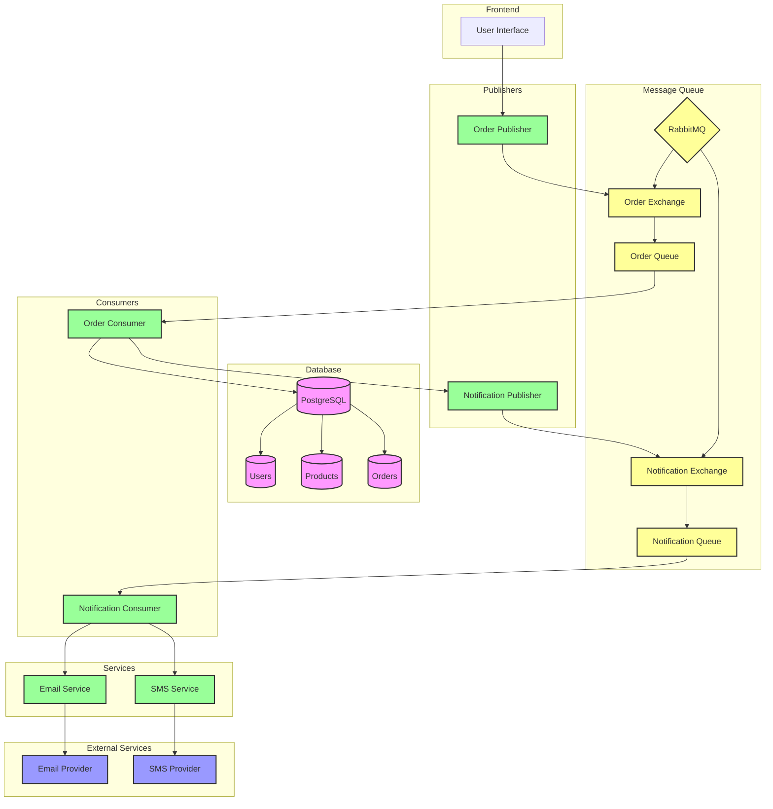

```mermaid
graph TB
    subgraph "Frontend"
        UI[User Interface]
    end

    subgraph "Database"
        DB[(PostgreSQL)]
        DB_USERS[(Users)]
        DB_PRODUCTS[(Products)]
        DB_ORDERS[(Orders)]
        DB --> DB_USERS
        DB --> DB_PRODUCTS
        DB --> DB_ORDERS
    end

    subgraph "Message Queue"
        RMQ{RabbitMQ}
        ORDER_EX[Order Exchange]
        NOTIF_EX[Notification Exchange]
        ORDER_Q[Order Queue]
        NOTIF_Q[Notification Queue]
        
        RMQ --> ORDER_EX
        RMQ --> NOTIF_EX
        ORDER_EX --> ORDER_Q
        NOTIF_EX --> NOTIF_Q
    end

    subgraph "Publishers"
        OP[Order Publisher]
        NP[Notification Publisher]
    end

    subgraph "Consumers"
        OC[Order Consumer]
        NC[Notification Consumer]
    end

    subgraph "Services"
        ES[Email Service]
        SMS[SMS Service]
    end

    subgraph "External Services"
        EMAIL_PROVIDER[Email Provider]
        SMS_PROVIDER[SMS Provider]
    end

    %% Flow connections
    UI --> OP
    OP --> ORDER_EX
    OC --> DB
    ORDER_Q --> OC
    OC --> NP
    NP --> NOTIF_EX
    NOTIF_Q --> NC
    NC --> ES
    NC --> SMS
    ES --> EMAIL_PROVIDER
    SMS --> SMS_PROVIDER

    %% Styling
    classDef database fill:#f9f,stroke:#333,stroke-width:2px
    classDef queue fill:#ff9,stroke:#333,stroke-width:2px
    classDef service fill:#9f9,stroke:#333,stroke-width:2px
    classDef external fill:#99f,stroke:#333,stroke-width:2px

    class DB,DB_USERS,DB_PRODUCTS,DB_ORDERS database
    class RMQ,ORDER_EX,NOTIF_EX,ORDER_Q,NOTIF_Q queue
    class OP,NP,OC,NC,ES,SMS service
    class EMAIL_PROVIDER,SMS_PROVIDER external
```
